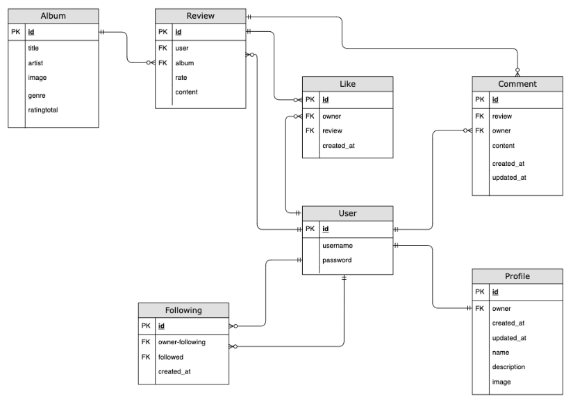

# AlbumTalk API

<br>
AlbumTalk is a dynamic web application designed for music enthusiasts to write, share, and discuss reviews of music albums. It serves as a community platform where users can discover new music, express their opinions on albums, and engage in meaningful discussions with fellow music lovers. The application aims to foster a vibrant community centered around music appreciation and critique.

## Table of Contents


## Objective
The AlbumTalk API is a RESTful web service that powers the AlbumTalk web application. It provides endpoints for user management, album review operations, search functionality, and user interactions. The API ensures that the application remains secure, scalable, and efficient, providing a seamless user experience.

### AlbumTalk web application


## Live Page
[](https://.herokuapp.com/)


# Planning and Agile

## Design:
Described in the readme for the web application

## Wireframes:
Described in the readme for the web application

## Agile:
The API and Frontend of this project was planned using Agile methodology and MoSCoW prioritization on github projects.<br>

The user stories project can be found [here](https://github.com/users/Hujanen91/projects/9) 

## Labels used:
`must-have`
`should-have`
`couldhave`
`wont-have`
`future improvement`
`user story`<br>

The project...


## User Stories
The user stopries are described in a more detailed way in the documentation for the web application. Here they are just listed to show what functionality the api is supposed to support.


## Entity Relationship Diagram
After defining the user stories for AlbumTalk, the next step was to design the Entity Relationship Diagram (ERD) to represent the data model and relationships between different entities. Here's a  description of how the entity relationship was created based on the user stories:

1. **User Registration and Login**
   - **Entities Identified:** User
   - **Attributes:** `user_id`, `username`, `email`, `password`, `created_at`
   - **Relationships:** None initially, but users will have relationships with reviews, comments, and ratings they create.

2. **Write an Album Review**
   - **Entities Identified:** Review, Album
   - **Attributes for Review:** `review_id`, `user_id`, `album_id`, `title`, `rating`, `content`, `created_at`, `updated_at`
   - **Attributes for Album:** `album_id`, `title`, `artist`, `genre`, `release_date`, `cover_image`
   - **Relationships:** A review is linked to a user and an album.

3. **View Album Reviews**
- **Entities Identified:** Review (already identified)
- **Relationships:** Reviews need to be retrievable by album, requiring a foreign key from review to album.

4. **Edit or Delete Own Review**
   - **Entities Identified:** Review (already identified)
   - **Relationships:** Reviews need to be linked to the user who created them to enforce permissions.

5. **Search for Albums and Reviews**
   - **Entities Identified:** Album, Review (already identified)
   - **Relationships:** Ensures that albums can be searched and reviews can be retrieved based on album identifiers.

6. **Rate and Comment on Reviews**
   - **Entities Identified:** Comment, Rating
   - **Attributes for Comment:** `comment_id`, `review_id`, `user_id`, `content`, `created_at`
   - **Attributes for Rating:** `rating_id`, `review_id`, `user_id`, `is_helpful`, `created_at`
   - **Relationships:** Comments and ratings are linked to reviews and users.

### Defining Relationships

1. **User and Review:**
   - **Relationship:** One user can write multiple reviews.
   - **Type:** One-to-Many
   - **Foreign Key:** `user_id` in the Review entity.

2. **Album and Review:**
   - **Relationship:** One album can have multiple reviews.
   - **Type:** One-to-Many
   - **Foreign Key:** `album_id` in the Review entity.

3. **Review and Comment:**
   - **Relationship:** One review can have multiple comments.
   - **Type:** One-to-Many
   - **Foreign Key:** `review_id` in the Comment entity.

4. **User and Comment:**
   - **Relationship:** One user can write multiple comments.
   - **Type:** One-to-Many
   - **Foreign Key:** `user_id` in the Comment entity.

5. **Review and Rating:**
   - **Relationship:** One review can have multiple ratings.
   - **Type:** One-to-Many
   - **Foreign Key:** `review_id` in the Rating entity.

6. **User and Rating:**
   - **Relationship:** One user can rate multiple reviews.
   - **Type:** One-to-Many
   - **Foreign Key:** `user_id` in the Rating entity.

### Summary of Entity Relationships

1. **User**: Central entity linking to reviews, comments, and ratings.
   - Writes multiple reviews.
   - Writes multiple comments.
   - Gives multiple ratings.

2. **Album**: Entity representing music albums.
   - Has multiple reviews.

3. **Review**: Entity representing reviews written for albums.
   - Written by one user.
   - Belongs to one album.
   - Has multiple comments.
   - Receives multiple ratings.

4. **Comment**: Entity representing comments on reviews.
   - Written by one user.
   - Belongs to one review.

5. **Rating**: Entity representing ratings for reviews.
   - Given by one user.
   - Belongs to one review.

<br>


## Endpoints

| **Endpoint**                            | **Method** | **Description**                                        | **Request Body**                                                                                                                                                                                                                                           |
|-----------------------------------------|------------|--------------------------------------------------------|------------------------------------------------------------------------------------------------------------------------------------------------------------------------------------------------------------------------------------------------------------|
| `/api/users/register`                   | POST       | Registers a new user                                   | `{ "username": "exampleUser", "email": "user@example.com", "password": "securePassword" }`                                                                                                                                                                 |
| `/api/users/login`                      | POST       | Authenticates a user and returns a JWT                 | `{ "email": "user@example.com", "password": "securePassword" }`                                                                                                                                                                                            |
| `/api/users/profile`                    | GET        | Retrieves the authenticated user's profile             | Headers: `Authorization: Bearer <jwt-token>`                                                                                                                                                                                                               |
| `/api/albums/search`                    | GET        | Searches for albums by title, artist, or genre         | Query Parameters: `title` (optional), `artist` (optional), `genre` (optional)                                                                                                                                                                              |
| `/api/albums/{album_id}`                | GET        | Retrieves details of a specific album                  | None                                                                                                                                                                                                                                                       |
| `/api/reviews`                          | POST       | Creates a new review for an album                      | Headers: `Authorization: Bearer <jwt-token>` <br> Body: `{ "album_id": "1", "title": "Review Title", "rating": 5, "content": "This is a detailed review of the album." }                                                                                   |
| `/api/albums/{album_id}/reviews`        | GET        | Retrieves all reviews for a specific album             | None                                                                                                                                                                                                                                                       |
| `/api/reviews/{review_id}`              | PUT        | Edits an existing review                               | Headers: `Authorization: Bearer <jwt-token>` <br> Body: `{ "title": "Updated Review Title", "rating": 4, "content": "This is an updated review of the album." }                                                                                           |
| `/api/reviews/{review_id}`              | DELETE     | Deletes a review                                       | Headers: `Authorization: Bearer <jwt-token>`                                                                                                                                                                                                               |
| `/api/reviews/{review_id}/comments`     | POST       | Adds a comment to a review                             | Headers: `Authorization: Bearer <jwt-token>` <br> Body: `{ "content": "This is a comment on the review." }                                                                                                                                                |
| `/api/reviews/{review_id}/comments`     | GET        | Retrieves all comments for a specific review           | None                                                                                                                                                                                                                                                       |
| `/api/reviews/{review_id}/ratings`      | POST       | Rates a review as helpful or not helpful               | Headers: `Authorization: Bearer <jwt-token>` <br> Body: `{ "is_helpful": true }`                                                                                                                                                                           |
| `/api/reviews/{review_id}/ratings`      | GET        | Retrieves the ratings for a specific review            | None                                                                                                                                                                                                                                                       |
## AlbumTalk API with External Data Integration from AudioDB

**Overview:**
The AlbumTalk API integrates with the external AudioDB API to fetch artist and album data. When a user searches for an artist, the AlbumTalk API handles the request by querying the AudioDB API, storing the retrieved album data in its database, and returning a list of the artist's albums to the user. This approach ensures that AlbumTalk maintains its own records of albums while leveraging the comprehensive music database provided by AudioDB.

### Workflow

1. **User Search Request:**
   - The user enters an artist's name in the web application's search bar and submits the request.
   - A request is sent to the AlbumTalk API to search for the artist's albums.

2. **AlbumTalk API Processes Request:**
   - The AlbumTalk API receives the search request and constructs a query to the AudioDB API.
   - Endpoint used: `https://theaudiodb.com/api/v1/json/1/searchalbum.php?s={artistName}`

3. **Query AudioDB API:**
   - The AlbumTalk API sends a GET request to the AudioDB API with the artist's name.
   - Example URL: `https://theaudiodb.com/api/v1/json/1/searchalbum.php?s=Coldplay`

4. **Receive and Process AudioDB Response:**
   - The AudioDB API responds with a JSON object containing a list of albums by the specified artist.
   - Example Response:
     ```json
     {
       "album": [
         {
           "idAlbum": "2115883",
           "strAlbum": "A Head Full of Dreams",
           "strArtist": "Coldplay",
           "intYearReleased": "2015",
           "strGenre": "Alternative Rock",
           "strAlbumThumb": "https://www.theaudiodb.com/images/media/album/thumb/head_full_of_dreams.jpg"
         },
         ...
       ]
     }
     ```

5. **Store Albums in AlbumTalk Database:**
   - The AlbumTalk API iterates through the list of albums received from AudioDB.
   - For each album, it checks if the album already exists in the local database to avoid duplicates.
   - If an album does not exist, it creates a new record in the Album table.
   - Example Album Entity:
     ```json
     {
       "album_id": "2115883",
       "title": "A Head Full of Dreams",
       "artist": "Coldplay",
       "genre": "Alternative Rock",
       "release_date": "2015-12-04",
       "cover_image": "https://www.theaudiodb.com/images/media/album/thumb/head_full_of_dreams.jpg"
     }
     ```

6. **Return Album List to User:**
   - After storing the albums, the AlbumTalk API constructs a list of albums for the artist.
   - This list is returned as a response to the original search request made by the user.
   - Example Response:
     ```json
     [
       {
         "album_id": "2115883",
         "title": "A Head Full of Dreams",
         "artist": "Coldplay",
         "genre": "Alternative Rock",
         "release_date": "2015-12-04",
         "cover_image": "https://www.theaudiodb.com/images/media/album/thumb/head_full_of_dreams.jpg"
       },
       ...
     ]
     ```

### API Endpoints and Database Schema

#### Search Albums by Artist
- **Endpoint:** `GET /api/albums/search`
- **Description:** Searches for albums by artist name, fetches data from AudioDB, stores albums in the local database, and returns a list of albums.
- **Request Parameters:** `artistName`
- **Response:** List of albums by the artist.

#### Album Entity Schema
- **Table:** Albums
- **Attributes:**
  - `album_id` (string, Primary Key)
  - `title` (string)
  - `artist` (string)
  - `genre` (string)
  - `release_date` (date)
  - `cover_image` (string)


## Features and Functionality for Superusers


<br>


# Testing


<b>[Detailed manual testing is located here](/Testing.md)</b>


## Deployed admin Screens

<details>
<summary><b>Django admin panel</b></summary>
<summary>

TBD

</summary>
</details>

<details>
<summary><b>Deployed API overview</b></summary>
<summary>


  Below are screenshots of the deployed API that displays the main overview and that the paths are working correctly and not displaying any sensitive information, the main testing was done in the local API to get more details and information when testing and can be found [here](#manual-testing) and the live API can be found 


</summary>
</details>

## Validation
CI Python Linter was also used in parallel with the development of the API, to keep the code free of errors.


After solving the minor errors above all python code in all apps are now All clear and without errors:


## Future Improvements


## Installed Python Packages
The following packages were installed when developing this project:

# Development and Deployment
 

## Heroku
The website is being hosted and deployed on Heroku:
- Navigate to: "Create new app" add a unique name "djangorestframework-api" and select your region. Click "Create App"
- Head over to "Settings" tab and apply the respective config VARs
- Move to "Deploy" section and select "Github" method"
- From here search for the repository name "connect", from the GitHub account.
- Hit "Connect" and "Enable Automatic Deploys" to keep the the repository in parallel to Heroku.
- Manually "Deploy Main Branch".
- Upon successful deployment, retrieve the link for the mock terminal.
- The live app can be found [here]().

## Forking
Most commonly, forks are used to either propose changes to someone else's project or to use someone else's project as a starting point for your own idea.

- Navigate to the GitHub Repository you want to 
  fork.

- On the top right of the page under the header, 
  click the fork button.

- This will create a duplicate of the full 
  project in your GitHub Repository.

## Languages and Technologies
- Django REST Framework (Python Framework - API)

## Other forms of development
- [Github](https://github.com/) - Host for the repository
- [Gitpod](https://gitpod.io/) - Code editor
- [Cloudinary](https://cloudinary.com/) - Static & Media host
- [Heroku](https://id.heroku.com/) - Cloud platform/Host the live project

# Credits

The following sources and references were resorted for the creation of this website:

- The lessons and tutorials provided by Code Institute, on the final module entitled "Django REST Framework" for the 'Advanced Front-End' specialization


## Media:

## Data


# Acknowledgements
- My mentor 