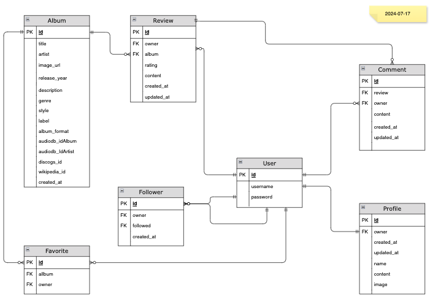

# AlbumTalk API

AlbumTalk is a dynamic web application designed for music enthusiasts to write, share, and discuss reviews of music albums. It serves as a community platform where users can discover new music, express their opinions on albums, and engage in meaningful discussions with fellow music lovers. The application aims to foster a vibrant community centered around music appreciation and critique.

The AlbumTalk API is a RESTful web service that powers the AlbumTalk web application. It provides endpoints for user management, album review operations, search functionality, and user interactions. The API ensures that the application remains secure, scalable, and efficient, providing a seamless user experience.

In this specific version of the API, only albums by David Bowie are handled.

The deployed api can be found [here](https://albumtalk-api-9fb1bb849439.herokuapp.com/).

## Table of contents
<!-- TOC -->

- [AlbumTalk API](#albumtalk-api)
    - [Table of contents](#table-of-contents)
    - [Agile:](#agile)
    - [User Stories](#user-stories)
    - [Entity Relationship Diagram](#entity-relationship-diagram)
        - [Summary of Entity Relationships](#summary-of-entity-relationships)
    - [Endpoints](#endpoints)
    - [The use of data from AudioDB](#the-use-of-data-from-audiodb)
        - [AudioDB API](#audiodb-api)
    - [Testing](#testing)
    - [Validation](#validation)
    - [Future Improvements](#future-improvements)
    - [Installed Python Packages](#installed-python-packages)
    - [Development and Deployment](#development-and-deployment)
        - [Forking and setting up the project in VS Code](#forking-and-setting-up-the-project-in-vs-code)
        - [Set up the Heroku Application](#set-up-the-heroku-application)
    - [Languages and Technologies](#languages-and-technologies)
    - [Other tools](#other-tools)
    - [Credits](#credits)
    - [Media](#media)
    - [Data](#data)
    - [Acknowledgements](#acknowledgements)

<!-- /TOC -->

## Agile:

The API and Frontend of this project was planned and developed using Agile methodology and MoSCoW prioritization on github projects. This is described in more detail in the readme for the AlbumTalk web application.<br>

The project can be found [here](https://github.com/users/andersganander/projects/6)

## User Stories

The user stories are described in a more detailed way in the documentation for the web application. Here they are just listed to show what functionality the api is supposed to support.


| Epic            | User stories                                                                             |
| ----------------- | :----------------------------------------------------------------------------------------- |
| Authentication  | Create account<br />, Login, Update user credentials, Logout                             |
| Navigation      | N/A for API                                                                              |
| Albums          | Add favorite album, Album list, List of mosted rated album                               |
| Reviews         | Write a review, Edit a review, Delete a review, view album specific reviews, List review |
| Comments        | Write a comment, Edit a comment, Delete a comment                                        |
| Profile page    | Eit profile, View profile page, User statistics                                          |
| Follow/unfollow | Follow and unfollow users                                                                |
| Search          | Search for reviews and albums                                                            |

## Entity Relationship Diagram

After defining the user stories for AlbumTalk, the next step was to design the Entity Relationship Diagram (ERD) to represent the data model and relationships between different entities. Here's a  description of how the entity relationship was created based on the most significant user stories:

1. **User Registration and Login**

   - **Entities Identified:** User, Profile
   - **Attributes for User:** `id` ,`username`,  `password`
   - **Attributes for Profile:** `id` ,`owner`,  `name`, `content`, `image`, `created_at`, `updated at`
   - **Relationships:** Profile is created and related when user is created. Users will have relationships with reviews, comments, and ratings they create.
2. **Write an Album Review**

   - **Entities Identified:** Review, Album
   - **Attributes for Review:** `id`, `owner`, `album`, `rating`, `content`, `created_at`, `updated_at`
   - **Attributes for Album:** `id`, `title`, `artist`, `image_url`, `release_year`, `description`, `genre`, `style`, `label`, `album_format`, `audiodb_idAlbum`, `audiodb_idArtist`, `discogs_id`, `wikipedia_id`, `created_at`
   - **Relationships:** A review is linked to a user and an album.
3. **View Album Reviews**

- **Entities Identified:** Review (already identified)
- **Relationships:** Reviews need to be retrievable by album, requiring a foreign key from review to album.

4. **Edit or Delete Own Review**

   - **Entities Identified:** Review (already identified)
   - **Relationships:** Reviews need to be linked to the user who created them to enforce permissions.
5. **Search for Albums and Reviews**

   - **Entities Identified:** Album, Review (already identified)
   - **Relationships:** Ensures that albums can be searched and reviews can be retrieved based on album identifiers.
6. **Comment on Reviews**

   - **Entities Identified:** Comment
   - **Attributes for Comment:** `id`, `review`, `user`, `content`, `created_at`, `updated_at`
   - **Relationships:** Comments are linked to reviews and users.
7. **Add favorite album**

- **Entities Identified:** Favorite
- **Attributes for Favorite:** `id`, `album`, `user`
- **Relationships:** Favorites are linked to albums and users.

8. **Follow and unfollow users**

- **Entities Identified:** Follower
- **Attributes for Comment:** `id`, `owner`, `followed`, `created_at`
- **Relationships:** Followers are linked to users both for owner and followed.

### Summary of Entity Relationships

1. **User**: Central entity linking to reviews, comments, followers, favorites and profiles

   - Writes multiple reviews.
   - Writes multiple comments.
   - Linked to one profile.
   - Linked to other user objects for following.
   - Can have multiple favorites (TODO: UPDATE ERD)
2. **Album**: Entity representing music albums.

   - Has multiple reviews.
   - Linked to Favorites
3. **Review**: Entity representing reviews written for albums.

   - Written by one user.
   - Belongs to one album.
   - Has multiple comments.
4. **Comment**: Entity representing comments on reviews.

   - Written by one user.
   - Belongs to one review.
5. **Profile**: Entity representing ratings for reviews.

   - Given by one user.
   - Belongs to one review.
6. **Follower**: Entity representing followers.

   - One user is owner.
   - One user id followed.
7. **Favorite**: Entity representing favorite albums.

   - Belongs to a user.
   - Related to one album
   - A user can have multiple favorites.

<br>


## Endpoints

Below are descriptions of the endpoints specific to AlbumTalk. Endpoints for registration and login, which are part of dj-rest-auth, are not described.


| **Endpoint**                    | **Method** | **Description**                                                             |   |
| :-------------------------------- | :----------- | ----------------------------------------------------------------------------- | :-- |
|                                 |            |                                                                             |   |
| `/profiles`                     | GET        | Retrieves a list of all profiles                                            |   |
| `/profiles/{profile_id}`        | GET        | Retrieves a specific profile                                                |   |
| `/albums/search`                | GET        | Searches for albums by title, artist, or genre                              |   |
| `/albums/`                      | GET        | Retrieves a list of all albums                                              |   |
| `/albums/{album_id}`            | GET        | Retrieves details of a specific album                                       |   |
| `/reviews/`                     | POST       | Creates a new review for an album                                           |   |
| `/reviews/?album={album_id}`    | GET        | Retrieves all reviews for a specific album                                  |   |
| `/reviews/{review_id}`          | PATCH      | Edits an existing review                                                    |   |
| `/reviews/{review_id}`          | DELETE     | Deletes a review                                                            |   |
| `/comments/`                    | POST       | Adds a comment to a review                                                  |   |
| `/comments/{comment_id}`        | DELETE     | Removes a comment                                                           |   |
| `/comments/?review={review_id}` | GET        | Retrieves all comments for a specific review                                |   |
| `/favorites/`                   | GET        | Retrieves a list of all favorites                                           |   |
| `/favorites/`                   | POST       | Adds a favorite album for a user                                            |   |
| `/favorites/{favorite_id}/`     | DELETE     | Remove a favorite                                                           |   |
| `/followers/`                   | POST       | Add a profile to follow                                                     |   |
| `/followers/{following_id}/`    | DELETE     | Remove the profile from the list of the profiles that the user is following |   |

## The use of data from AudioDB

**Overview:**
In AlbumTalk, data from AudioDB is used to enrich the application's database with detailed album information. For instance, all albums by David Bowie were fetched from AudioDB and imported into the AlbumTalk database using the import_data function in the AlbumTalk API.

While most of the album details—such as titles, release dates, and track lists—are stored in the database, the images are not. Instead, image URLs are saved, and the images are fetched in real-time from AudioDB whenever needed. This approach ensures that the application has up-to-date access to album artwork without storing large image files locally.

### AudioDB API

The David Bowie albums where fetched with the following call:

https://www.theaudiodb.com/api/v1/json/{api_key}/searchalbum.php?s=david bowie

which returned a list of albums in json format like the one below:

```json
{
   "idAlbum": "2112357",
   "idArtist": "111444",
   "idLabel": "45344",
   "strAlbum": "Diamond Dogs",
   "strAlbumStripped": "Diamond Dogs",
   "strArtist": "David Bowie",
   "strArtistStripped": "David Bowie",
   "intYearReleased": "1974",
   "strStyle": "Rock/Pop",
   "strGenre": "Rock",
   "strLabel": "RCA",
   "strReleaseFormat": "Album",
   "intSales": "0",
   "strAlbumThumb": "https://www.theaudiodb.com/images/media/album/thumb/diamond-dogs-4e23da281e277.jpg",
   "strAlbumThumbHQ": null,
   "strAlbumBack": "https://www.theaudiodb.com/images/media/album/back/xuuxpt1575219128.jpg",
   "strAlbumCDart": "https://www.theaudiodb.com/images/media/album/cdart/nidjiu1605562961.png",
   "strAlbumSpine": null,
   "strAlbum3DCase": "https://www.theaudiodb.com/images/media/album/3dcase/yx0zrq1605562970.png",
   "strAlbum3DFlat": "https://www.theaudiodb.com/images/media/album/3dflat/cn6v2l1605562990.png",
   "strAlbum3DFace": "https://www.theaudiodb.com/images/media/album/3dface/4mhok61605562997.png",
   "strAlbum3DThumb": "https://www.theaudiodb.com/images/media/album/3dthumb/4eynxa1605562978.png",
   "strDescriptionEN": "Diamond Dogs is a concept album by David Bowie, originally released in 1974 on RCA Records, his eighth album. Thematically, it was a marriage of the novel Nineteen Eighty-Four by George Orwell and Bowie's own glam-tinged vision of a post-apocalyptic world. Bowie had wanted to make a theatrical production of Orwell's book and began writing material after completing sessions for his 1973 album Pin Ups, but the late author’s estate denied the rights. The songs wound up on the second half of Diamond Dogs instead where, as the titles indicated, the Nineteen Eighty-Four theme was prominent.",
   "strDescriptionDE": null,
   "strDescriptionFR": null,
   "strDescriptionCN": null,
   "strDescriptionIT": null,
   "strDescriptionJP": null,
   "strDescriptionRU": null,
   "strDescriptionES": null,
   "strDescriptionPT": null,
   "strDescriptionSE": null,
   "strDescriptionNL": null,
   "strDescriptionHU": null,
   "strDescriptionNO": null,
   "strDescriptionIL": null,
   "strDescriptionPL": null,
   "intLoved": null,
   "intScore": "8",
   "intScoreVotes": "2",
   "strReview": "",
   "strMood": "Weird",
   "strTheme": null,
   "strSpeed": "",
   "strLocation": null,
   "strMusicBrainzID": "0dc4835d-b21a-3612-bac6-ab1e782a1396",
   "strMusicBrainzArtistID": "5441c29d-3602-4898-b1a1-b77fa23b8e50",
   "strAllMusicID": "mw0000597759",
   "strBBCReviewID": null,
   "strRateYourMusicID": "diamond_dogs",
   "strDiscogsID": "20141",
   "strWikidataID": "Q1629619",
   "strWikipediaID": "Diamond_Dogs",
   "strGeniusID": null,
   "strLyricWikiID": null,
   "strMusicMozID": null,
   "strItunesID": null,
   "strAmazonID": null,
   "strLocked": "unlocked"
}
```

The full documentation of the AudioDB API can be found here:
[AudioDB API](https://www.theaudiodb.com/free_music_api)

## Testing

The testing process of the AlbumTalk API involved a combination of manual and indirect testing methods:

**Manual Testing:**
During the development of the API and the AlbumTalk web application, the API endpoints were manually tested. This process included making requests to the endpoints, verifying responses, checking error handling, and ensuring correct data retrieval and manipulation. These tests aimed to ensure that the API was functioning as intended and meeting the requirements.

**Indirect Testing via Web Application:**
The API was also tested indirectly while validating user stories for the AlbumTalk web application. These user stories, documented as part of the development process, covered various application functionalities that depend on the API. By testing the web application against these user stories, the API's integration and performance were evaluated in a real-world context, ensuring it correctly supports the application's features.

This dual approach ensured that the API was robust, met user requirements, and integrated seamlessly with the web application.

The result of the testing of the user stories can be found [here](/Testing.md)

## Validation

The Flake8 extension was actively used during the development process to ensure that the Python code adhered to the PEP 8 standard for style and readability. CI Python Linter was also used to verify this. All errors that appeared was corrected during the development process.

## Future Improvements

Currently, AlbumTalk is a proof of concept for a music discussion forum centered around various artists' albums. In the proof of concept, only one artist's albums are available, and these were imported through a one-time import. The next step is to enable discussions about multiple artists and their albums. This could be done by integration with the AudioDB API to enable dynamic content creation. Here's how it would work:

**Dynamic Artist Page Creation:**

When a user searches for an artist not already present in the AlbumTalk database, the API will query the AudioDB API in real-time to fetch detailed information about the artist, including their biography, albums, and other relevant data. This data would then be stored in the AlbumTalk database.

The integration will ensure that users can discover and explore artists seamlessly, even if they are not part of the pre-imported dataset.
This feature improves the completeness of AlbumTalk’s offering without requiring manual data imports.

To achieve this, some changes need to be done to the database models.

## Installed Python Packages

The following packages were installed when developing this project:
- asgiref
- cloudinary
- dj-database-url
- dj-rest-auth
- Django
- django-allauth
- django-cloudinary-storage
- django-cors-headers
- django-filter
- djangorestframework
- djangorestframework-simplejwt
- gunicorn
- oauthlib
- pillow
- psycopg2
- PyJWT
- python3-openid
- requests-oauthlib
- sqlparse

## Development and Deployment

### Forking and setting up the project in VS Code

- Fork the repository

  - Login to your GitHub account
  - Navigate to the repository (https://github.com/andersganander/AlbumTalk_API)
  - Click the Fork button at the top-right corner of the page.
  - This creates a copy of the repository under your GitHub account.
- Clone the forked repository

  - Clone the forked repository to your local machine:
    git clone https://github.com/your-username/repository-name.git
- Open the Project in VS Code

  - Open VS Code
  - Select File > Open Folder and navigate to the folder where you cloned the repository.
- Set Up a Virtual Environment

  - Open the integrated terminal in VS Code
  - Create a virtual environment:
    <code>python -m venv venv</code>
  - Activate the virtual environment
    win: venv\Scripts\activate
    mac: source venv/bin/activate
- Install dependicies

  - Install the required dependencies using pip:
    <code>pip install -r requirements.txt</code>
- Set up the databaase

  - Apply database migrations
    <code>python manage.py migrate</code>
- Set up the environment variables

  - Create a env.py file in the project root and add the variables:
    - SECRET_KEY
    - DATABASE_URL
    - CLOUDINARY_URL
    - DEV
- Start the server

  - Start the development server
    <code>python manage.py start</code>


### Set up the Heroku Application
The api is being hosted and deployed on Heroku:

- Log in to the Heroku Dahboard
- Create a New App
   - Click New > Create New App
   - Choose a name for your app (e.g., your-app-name) and select a region.
- Set up GitHub integration
   - In your app's dashboard, go to the Deploy tab
   - Under Deployment method, select GitHub
   - Authenticate and search for your repository.
   - Click Connect to link the repository.
- Configure environment variables
   - Go to the Settings tab and click Reveal Config Vars
   - Add the following variables:
      - ALLOWED_HOSTS: the api's url
      - CLIENT_ORIGIN: the url of the front end web application
      - CLIENT_ORIGIN_DEV: the url of the front end web application when testing from your local environment
      - CLOUDINARY_URL: the cloudinary url
      - DISABLE_COLLECTSTATIC: 1
      - SECRET_KEY: The secret key
- Deploy the application
   - Automatic deployments
      - In the Deploy tab, enable Automatic Deploys if you want Heroku to deploy every time you push changes to the main branch.
   - Manual deployment
      - If you prefer, deploy manually by clicking Deploy Branch under Manual Deploy.
- Test the deployment
   - Open the application
      - Click the button that is shown after the deployment or click the button "Open app" in the upper right corner.
   - Monitor logs
      - In the More dropdown, select View Logs to troubleshoot any issues.

- The live app can be found [here](https://albumtalk-api-9fb1bb849439.herokuapp.com/).

## Languages and Technologies

- Django REST Framework (Python Framework - API)

## Other tools

- [Github](https://github.com/) - Repository.
- [Gitpod](https://gitpod.io/) - Code editor
- [Heroku](https://id.heroku.com/) - Cloud applicaation platform for hosting the api.
- [Cloudinary](https://cloudinary.com/) - Cloud based service for storing media. Used for storing profile images.
- [CI Python Linter](https://pep8ci.herokuapp.com/) - Python linting tool.
- Flake8 - VSCode extension that checks Python code for style and syntax errors.
- [UptimeRobot](https://uptimerobot.com/) - Uptime monitoring service. Due to database disruptions, monitoring was set up using UptimeRobot to rule out other issues. Monitoring was also implemented for the API developed in the walkthrough project.

## Credits

The following sources and references were resorted for the creation of this website:

- The lessons and tutorials offered by Code Institute in the final module, titled "Django REST Framework," as part of the 'Advanced Front-End' specialization.

## Media

- [AudioDB](https://www.theaudiodb.com/) - Images on the signin/signup page and cover image

## Data

- [AudioDB](https://www.theaudiodb.com/) - All album data is retrieved from the AudioDB database.

## Acknowledgements

- My mentor Antonio for tips and suggestions.
- The swedish community on Slack.
